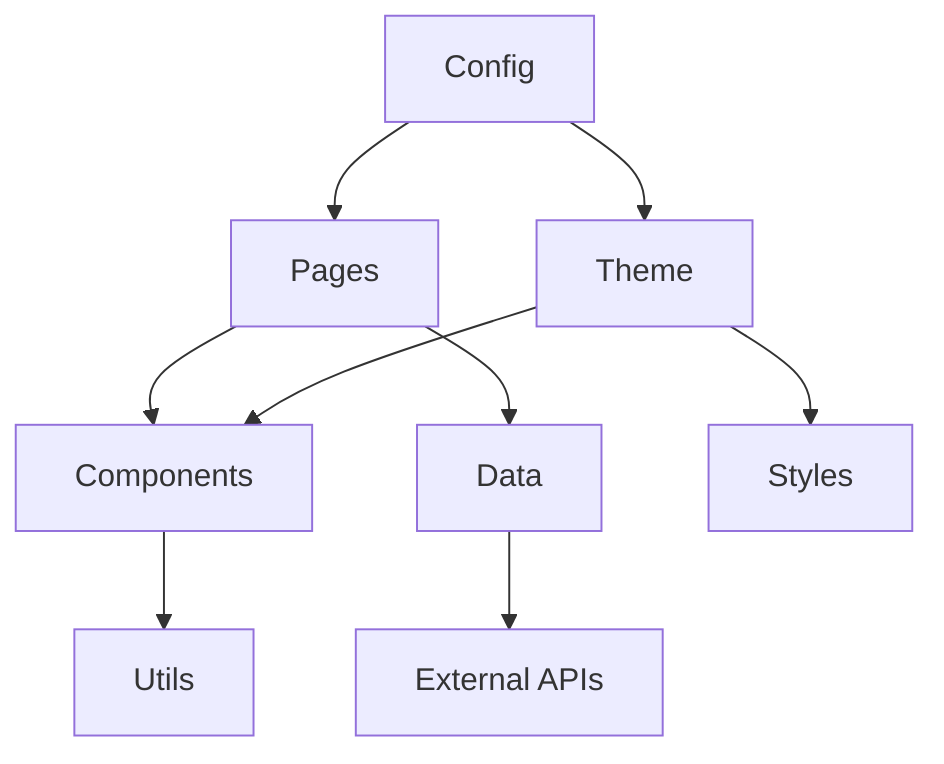
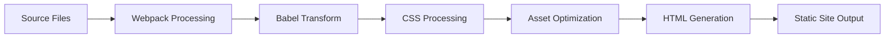

# 🏗️ 项目架构

详细介绍 RicMoe Docusaurus 主题的整体架构设计和技术选型。

## 📋 技术栈概览

### 核心框架

- **[Docusaurus 3.x](https://docusaurus.io/)** - 静态站点生成器
- **[React 18](https://react.dev/)** - 前端 UI 框架
- **[TypeScript](https://www.typescriptlang.org/)** - 类型安全的 JavaScript

### 构建工具

- **[Webpack 5](https://webpack.js.org/)** - 模块打包器（内置于 Docusaurus）
- **[Babel](https://babeljs.io/)** - JavaScript 编译器
- **[PostCSS](https://postcss.org/)** - CSS 后处理器

### 样式系统

- **CSS Modules** - 组件级样式隔离
- **CSS Variables** - 主题变量系统
- **Responsive Design** - 移动端适配

### 部署和 CI/CD

- **[GitHub Actions](https://github.com/features/actions)** - 自动化构建和部署
- **[GitHub Pages](https://pages.github.com/)** - 静态站点托管
- **微信 JSAPI** - 自动更新集成

## 🏛️ 项目结构

```
ricmoe-docusaurus/
├── 📁 .github/              # GitHub 配置
│   └── workflows/           # GitHub Actions 工作流
│       └── update-jsapi-ticket.yml
├── 📁 blog/                 # 博客文章
│   ├── authors.yml         # 作者信息
│   ├── tags.yml           # 标签配置
│   └── 2025-07-27-welcome/ # 示例文章
├── 📁 build/               # 构建输出目录
├── 📁 data/                # 数据文件
│   ├── Features.tsx       # 首页特性数据
│   ├── Links.tsx         # 友链数据
│   └── Moments.tsx       # 时刻数据
├── 📁 docs/                # 文档内容
│   ├── intro.mdx         # 文档入口
│   └── ricmoe-theme/     # 主题文档
├── 📁 i18n/                # 国际化配置
│   ├── en-us/            # 英文语言包
│   └── zh-hans/          # 中文语言包
├── 📁 src/                 # 源代码
│   ├── components/       # React 组件
│   ├── css/             # 全局样式
│   ├── pages/           # 页面组件
│   └── theme/           # 主题定制
├── 📁 static/              # 静态资源
│   ├── fonts/           # 字体文件
│   ├── img/             # 图片资源
│   └── js-helper/       # JavaScript 工具
├── 📄 docusaurus.config.ts # Docusaurus 配置
├── 📄 sidebars.ts         # 侧边栏配置
├── 📄 package.json        # 项目依赖
├── 📄 tsconfig.json       # TypeScript 配置
├── 📄 WeChatAccess.py     # 微信 API 脚本
└── 📄 requirements.txt    # Python 依赖
```

## 🎯 架构设计理念

### 1. 模块化设计

#### 组件分层

```
Components Layer 组件层
    ├── Layout Components     # 布局组件
    ├── Page Components      # 页面组件
    ├── Interactive Components # 交互组件
    └── Utility Components   # 工具组件

Data Layer 数据层
    ├── Static Data         # 静态数据（data/）
    ├── Dynamic Data        # 动态数据（API）
    └── Content Data        # 内容数据（docs/, blog/）

Service Layer 服务层
    ├── Build Services      # 构建服务
    ├── Deploy Services     # 部署服务
    └── External Services   # 外部服务（微信 API）
```

#### 依赖关系



### 2. 配置驱动

所有功能通过配置文件控制，降低代码耦合：

- `docusaurus.config.ts` - 主配置
- `sidebars.ts` - 导航配置
- `data/*.tsx` - 数据配置
- `i18n/` - 国际化配置

### 3. 内容与展现分离

- **内容**: Markdown/MDX 文件
- **数据**: TypeScript 数据文件
- **样式**: CSS Modules + CSS Variables
- **逻辑**: React 组件

## 📦 核心模块详解

### 1. 内容管理系统

#### 文档系统
```typescript
// docs/ 目录结构
docs/
├── intro.mdx              # 文档首页
└── ricmoe-theme/         # 主题文档
    ├── README.md         # 文档导航
    ├── moments/          # Moments 系统文档
    ├── wechat/          # 微信集成文档
    ├── components/      # 组件文档
    └── development/     # 开发文档
```

#### 博客系统
```typescript
// blog/ 目录结构
blog/
├── authors.yml          # 作者信息配置
├── tags.yml            # 标签系统配置
└── YYYY-MM-DD-title/   # 文章目录
    ├── index.mdx       # 文章内容
    └── assets/         # 文章资源
```

### 2. 组件系统架构

#### 组件分类

**页面级组件** (src/pages/)
- 完整页面的根组件
- 处理页面级状态管理
- 集成多个子组件

**功能组件** (src/components/)
- 可复用的功能单元
- 独立的样式和逻辑
- 通过 props 接收配置

**主题组件** (src/theme/)
- 覆盖 Docusaurus 默认组件
- 提供自定义主题功能
- 保持 Docusaurus API 兼容

#### 组件开发规范

```typescript
// 组件目录结构
ComponentName/
├── index.tsx           # 组件主文件
├── styles.module.css   # 样式文件
├── types.ts           # 类型定义
├── hooks.ts           # 自定义 Hooks
├── utils.ts           # 工具函数
└── __tests__/         # 测试文件
    ├── index.test.tsx
    └── utils.test.ts
```

### 3. 数据管理架构

#### 静态数据管理

```typescript
// data/Features.tsx - 首页特性数据
export interface FeatureItem {
  title: string;
  Svg: React.ComponentType<React.ComponentProps<'svg'>>;
  description: JSX.Element;
}

export const FeatureList: FeatureItem[] = [
  // 特性列表
];
```

#### 动态数据管理

```typescript
// 数据流向
API Call → Data Processing → Component State → UI Render

// 示例：Moments 数据管理
const [moments, setMoments] = useState<MomentItem[]>([]);
const [filteredMoments, setFilteredMoments] = useState<MomentItem[]>([]);

useEffect(() => {
  // 加载数据
  loadMomentsData().then(setMoments);
}, []);

useEffect(() => {
  // 过滤数据
  setFilteredMoments(filterMoments(moments, filters));
}, [moments, filters]);
```

### 4. 样式系统架构

#### CSS Variables 系统

```css
/* src/css/custom.css - 全局变量定义 */
:root {
  /* 颜色系统 */
  --ifm-color-primary: #2e8555;
  --ifm-color-primary-dark: #29784c;
  --ifm-color-primary-darker: #277148;
  
  /* 字体系统 */
  --ifm-font-family-base: system-ui, -apple-system, sans-serif;
  --ifm-font-size-base: 16px;
  
  /* 间距系统 */
  --ifm-spacing-vertical: 1rem;
  --ifm-spacing-horizontal: 1rem;
}
```

#### CSS Modules 组件样式

```css
/* ComponentName/styles.module.css */
.container {
  /* 使用全局变量 */
  color: var(--ifm-color-primary);
  padding: var(--ifm-spacing-vertical);
}

/* 响应式设计 */
@media (max-width: 768px) {
  .container {
    padding: calc(var(--ifm-spacing-vertical) / 2);
  }
}
```

## 🔧 构建系统架构

### 1. Docusaurus 构建流程



### 2. 自定义构建配置

```typescript
// docusaurus.config.ts
const config: Config = {
  // 基本配置
  title: 'RicMoe',
  tagline: '个人博客和技术分享',
  
  // 构建配置
  onBrokenLinks: 'throw',
  onBrokenMarkdownLinks: 'warn',
  
  // 插件配置
  plugins: [
    // 自定义插件
  ],
  
  // 主题配置
  themeConfig: {
    // 导航栏配置
    navbar: {},
    // 页脚配置
    footer: {},
    // 搜索配置
    algolia: {},
  } satisfies Preset.ThemeConfig,
};
```

### 3. TypeScript 集成

```typescript
// tsconfig.json
{
  "extends": "@docusaurus/tsconfig",
  "compilerOptions": {
    "strict": true,
    "esModuleInterop": true,
    "skipLibCheck": true,
    "moduleResolution": "node"
  },
  "include": [
    "src/**/*",
    "docs/**/*",
    "blog/**/*",
    "data/**/*"
  ]
}
```

## 🌐 国际化架构

### 1. 多语言支持

```typescript
// docusaurus.config.ts
const config: Config = {
  i18n: {
    defaultLocale: 'zh-Hans',
    locales: ['zh-Hans', 'en-US'],
    localeConfigs: {
      'zh-Hans': {
        label: '简体中文',
        direction: 'ltr',
      },
      'en-US': {
        label: 'English',
        direction: 'ltr',
      },
    },
  },
};
```

### 2. 翻译文件组织

```
i18n/
├── zh-hans/                    # 中文
│   ├── code.json              # 代码翻译
│   ├── docusaurus-plugin-content-blog/
│   │   └── options.json       # 博客插件翻译
│   ├── docusaurus-plugin-content-docs/
│   │   └── current.json       # 文档翻译
│   └── docusaurus-theme-classic/
│       ├── footer.json        # 页脚翻译
│       └── navbar.json        # 导航栏翻译
└── en-us/                     # 英文
    └── [同样结构]
```

## 🔄 状态管理架构

### 1. 组件级状态

```typescript
// 使用 React Hooks 管理组件状态
const [state, setState] = useState(initialState);
const [loading, setLoading] = useState(false);
const [error, setError] = useState<string | null>(null);
```

### 2. 全局状态（Context API）

```typescript
// contexts/ThemeContext.tsx
interface ThemeContextType {
  theme: 'light' | 'dark';
  toggleTheme: () => void;
}

const ThemeContext = createContext<ThemeContextType | undefined>(undefined);

export const useTheme = () => {
  const context = useContext(ThemeContext);
  if (!context) {
    throw new Error('useTheme must be used within ThemeProvider');
  }
  return context;
};
```

### 3. 数据持久化

```typescript
// utils/storage.ts
export const storage = {
  get: <T>(key: string, defaultValue: T): T => {
    try {
      const item = localStorage.getItem(key);
      return item ? JSON.parse(item) : defaultValue;
    } catch {
      return defaultValue;
    }
  },
  
  set: <T>(key: string, value: T): void => {
    localStorage.setItem(key, JSON.stringify(value));
  },
  
  remove: (key: string): void => {
    localStorage.removeItem(key);
  }
};
```

## 🔒 安全架构

### 1. 内容安全策略

```typescript
// docusaurus.config.ts
const config: Config = {
  headTags: [
    {
      tagName: 'meta',
      attributes: {
        'http-equiv': 'Content-Security-Policy',
        content: "default-src 'self'; script-src 'self' 'unsafe-inline' res.wx.qq.com;",
      },
    },
  ],
};
```

### 2. 输入验证和清理

```typescript
// utils/security.ts
export const sanitizeInput = (input: string): string => {
  return input
    .replace(/[<>]/g, '') // 移除尖括号
    .trim() // 去除首尾空格
    .slice(0, 1000); // 限制长度
};

export const validateEmail = (email: string): boolean => {
  const emailRegex = /^[^\s@]+@[^\s@]+\.[^\s@]+$/;
  return emailRegex.test(email);
};
```

### 3. API 安全

```typescript
// 微信 API 调用安全
const getJSAPITicket = async (): Promise<string> => {
  const response = await fetch('/api/jsapi-ticket', {
    method: 'POST',
    headers: {
      'Content-Type': 'application/json',
      'Authorization': `Bearer ${process.env.API_TOKEN}`,
    },
    body: JSON.stringify({
      timestamp: Date.now(),
      nonce: generateNonce(),
    }),
  });
  
  if (!response.ok) {
    throw new Error('Failed to fetch JSAPI ticket');
  }
  
  return response.text();
};
```

## 📊 性能架构

### 1. 代码分割

```typescript
// 动态导入组件
const LazyComponent = lazy(() => import('./HeavyComponent'));

// 路由级别的代码分割
const routes = [
  {
    path: '/moments',
    component: lazy(() => import('@site/src/pages/moments')),
  },
];
```

### 2. 缓存策略

```typescript
// Service Worker 缓存配置
const CACHE_NAME = 'ricmoe-v1';
const urlsToCache = [
  '/',
  '/static/css/main.css',
  '/static/js/main.js',
  '/img/logo.png',
];

self.addEventListener('install', (event) => {
  event.waitUntil(
    caches.open(CACHE_NAME)
      .then((cache) => cache.addAll(urlsToCache))
  );
});
```

### 3. 图片优化

```typescript
// 图片懒加载和优化
const useImageOptimization = (src: string) => {
  const [imageSrc, setImageSrc] = useState('');
  const [isLoading, setIsLoading] = useState(true);
  
  useEffect(() => {
    const img = new Image();
    img.onload = () => {
      setImageSrc(src);
      setIsLoading(false);
    };
    img.src = src;
  }, [src]);
  
  return { imageSrc, isLoading };
};
```

## 🔗 外部集成架构

### 1. 微信 SDK 集成

```typescript
// 微信 JS-SDK 初始化
interface WeChatConfig {
  debug: boolean;
  appId: string;
  timestamp: number;
  nonceStr: string;
  signature: string;
  jsApiList: string[];
}

const initWeChatSDK = (config: WeChatConfig): Promise<void> => {
  return new Promise((resolve, reject) => {
    wx.config(config);
    
    wx.ready(() => {
      console.log('WeChat SDK initialized');
      resolve();
    });
    
    wx.error((err) => {
      console.error('WeChat SDK initialization failed:', err);
      reject(err);
    });
  });
};
```

### 2. Cloudflare Turnstile 集成

```typescript
// Turnstile 验证集成
interface TurnstileResponse {
  success: boolean;
  challenge_ts: string;
  hostname: string;
  'error-codes'?: string[];
}

const verifyTurnstile = async (token: string): Promise<boolean> => {
  const response = await fetch('/api/verify-turnstile', {
    method: 'POST',
    headers: { 'Content-Type': 'application/json' },
    body: JSON.stringify({ token }),
  });
  
  const result: TurnstileResponse = await response.json();
  return result.success;
};
```

## 📈 监控和分析

### 1. 性能监控

```typescript
// 性能指标收集
const collectPerformanceMetrics = () => {
  const navigation = performance.getEntriesByType('navigation')[0] as PerformanceNavigationTiming;
  
  return {
    loadTime: navigation.loadEventEnd - navigation.loadEventStart,
    domContentLoaded: navigation.domContentLoadedEventEnd - navigation.domContentLoadedEventStart,
    firstPaint: performance.getEntriesByName('first-paint')[0]?.startTime || 0,
    firstContentfulPaint: performance.getEntriesByName('first-contentful-paint')[0]?.startTime || 0,
  };
};
```

### 2. 错误监控

```typescript
// 全局错误处理
window.addEventListener('error', (event) => {
  console.error('Global error:', event.error);
  // 发送错误报告到监控服务
});

window.addEventListener('unhandledrejection', (event) => {
  console.error('Unhandled promise rejection:', event.reason);
  // 发送错误报告到监控服务
});
```

## 🔗 相关文档

- [📦 构建配置详解](./build-config)
- [🚀 部署指南](./deployment)
- [🎯 组件开发指南](../components)

---

*想要深入了解某个模块？查看对应的专门文档！*
