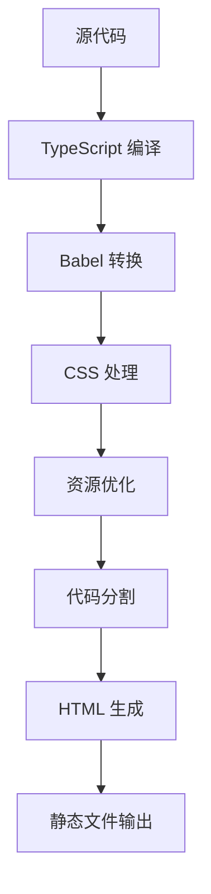

# 📦 构建配置

详细介绍 RicMoe Docusaurus 主题的构建系统配置和优化策略。

## 🏗️ 构建系统概览

### 构建工具链

- **Docusaurus 3.x** - 核心构建框架
- **Webpack 5** - 模块打包器
- **Babel** - JavaScript/TypeScript 编译器
- **PostCSS** - CSS 后处理器
- **Terser** - JavaScript 压缩器

### 构建流程



## ⚙️ 核心配置文件

### 1. Docusaurus 主配置

**文件**: `docusaurus.config.ts`

```typescript
import {themes as prismThemes} from 'prism-react-renderer';
import type {Config} from '@docusaurus/types';
import type * as Preset from '@docusaurus/preset-classic';

const config: Config = {
  // 基础配置
  title: 'RicMoe',
  tagline: '个人博客和技术分享',
  favicon: 'img/favicon.ico',
  url: 'https://ricmoe.github.io',
  baseUrl: '/ricmoe-docusaurus/',
  
  // 构建配置
  organizationName: 'RichardMiku',
  projectName: 'ricmoe-docusaurus',
  deploymentBranch: 'gh-pages',
  trailingSlash: false,
  
  // 错误处理
  onBrokenLinks: 'throw',
  onBrokenMarkdownLinks: 'warn',
  onDuplicateRoutes: 'warn',
  
  // 国际化
  i18n: {
    defaultLocale: 'zh-Hans',
    locales: ['zh-Hans', 'en-US'],
  },
  
  // 预设配置
  presets: [
    [
      'classic',
      {
        docs: {
          sidebarPath: './sidebars.ts',
          editUrl: 'https://github.com/RichardMiku/ricmoe-docusaurus/tree/main/',
        },
        blog: {
          showReadingTime: true,
          feedOptions: {
            type: 'all',
            copyright: `Copyright © ${new Date().getFullYear()} RicMoe.`,
          },
          editUrl: 'https://github.com/RichardMiku/ricmoe-docusaurus/tree/main/',
        },
        theme: {
          customCss: './src/css/custom.css',
        },
      } satisfies Preset.Options,
    ],
  ],
  
  // 主题配置
  themeConfig: {
    image: 'img/docusaurus-social-card.png',
    navbar: {
      title: 'RicMoe',
      logo: {
        alt: 'RicMoe Logo',
        src: 'img/logo.svg',
      },
      items: [
        // 导航项配置
      ],
    },
    footer: {
      // 页脚配置
    },
    prism: {
      theme: prismThemes.github,
      darkTheme: prismThemes.dracula,
      additionalLanguages: ['bash', 'json', 'python'],
    },
  } satisfies Preset.ThemeConfig,
};

export default config;
```

### 2. TypeScript 配置

**文件**: `tsconfig.json`

```json
{
  "extends": "@docusaurus/tsconfig",
  "compilerOptions": {
    "strict": true,
    "esModuleInterop": true,
    "allowSyntheticDefaultImports": true,
    "skipLibCheck": true,
    "moduleResolution": "node",
    "resolveJsonModule": true,
    "isolatedModules": true,
    "noEmit": true,
    "jsx": "react-jsx",
    "baseUrl": ".",
    "paths": {
      "@site/*": ["./src/*"],
      "@generated/*": ["./.docusaurus/*"]
    }
  },
  "include": [
    "src/**/*",
    "docs/**/*",
    "blog/**/*",
    "data/**/*",
    "docusaurus.config.ts",
    "sidebars.ts"
  ],
  "exclude": [
    "node_modules",
    "build",
    ".docusaurus"
  ]
}
```

### 3. 侧边栏配置

**文件**: `sidebars.ts`

```typescript
import type {SidebarsConfig} from '@docusaurus/plugin-content-docs';

const sidebars: SidebarsConfig = {
  // 主文档侧边栏
  tutorialSidebar: [
    'intro',
    {
      type: 'category',
      label: 'RicMoe 主题',
      items: [
        'ricmoe-theme/README',
        {
          type: 'category',
          label: '⏰ Moments 系统',
          items: [
            'ricmoe-theme/moments/README',
            'ricmoe-theme/moments/overview',
            'ricmoe-theme/moments/quick-start',
            // ... 更多子项
          ],
        },
        {
          type: 'category',
          label: '📱 微信集成',
          items: [
            'ricmoe-theme/wechat/README',
            'ricmoe-theme/wechat/jsapi-ticket',
            'ricmoe-theme/wechat/share-config',
          ],
        },
        // ... 更多分类
      ],
    },
  ],
};

export default sidebars;
```

### 4. 包管理配置

**文件**: `package.json`

```json
{
  "name": "ricmoe-docusaurus",
  "version": "1.0.0",
  "private": true,
  "scripts": {
    "docusaurus": "docusaurus",
    "start": "docusaurus start",
    "build": "docusaurus build",
    "swizzle": "docusaurus swizzle",
    "deploy": "docusaurus deploy",
    "clear": "docusaurus clear",
    "serve": "docusaurus serve",
    "write-translations": "docusaurus write-translations",
    "write-heading-ids": "docusaurus write-heading-ids",
    "typecheck": "tsc --noEmit",
    "lint": "eslint . --ext .ts,.tsx,.js,.jsx",
    "lint:fix": "eslint . --ext .ts,.tsx,.js,.jsx --fix"
  },
  "dependencies": {
    "@docusaurus/core": "3.6.3",
    "@docusaurus/preset-classic": "3.6.3",
    "@docusaurus/theme-classic": "3.6.3",
    "@mdx-js/react": "^3.0.0",
    "clsx": "^2.0.0",
    "prism-react-renderer": "^2.3.0",
    "react": "^18.0.0",
    "react-dom": "^18.0.0"
  },
  "devDependencies": {
    "@docusaurus/module-type-aliases": "3.6.3",
    "@docusaurus/tsconfig": "3.6.3",
    "@docusaurus/types": "3.6.3",
    "@types/react": "^18.2.0",
    "typescript": "~5.2.2"
  }
}
```

## 🎨 CSS 和样式配置

### 1. 全局样式配置

**文件**: `src/css/custom.css`

```css
/**
 * Any CSS included here will be global. The classic template
 * bundles Infima by default. Infima is a CSS framework designed to
 * work well for content-centric websites.
 */

/* You can override the default Infima variables here. */
:root {
  --ifm-color-primary: #2e8555;
  --ifm-color-primary-dark: #29784c;
  --ifm-color-primary-darker: #277148;
  --ifm-color-primary-darkest: #205d3b;
  --ifm-color-primary-light: #33925d;
  --ifm-color-primary-lighter: #359962;
  --ifm-color-primary-lightest: #3cad6e;
  --ifm-code-font-size: 95%;
  --docusaurus-highlighted-code-line-bg: rgba(0, 0, 0, 0.1);
}

/* For readability concerns, you should choose a lighter palette in dark mode. */
[data-theme='dark'] {
  --ifm-color-primary: #25c2a0;
  --ifm-color-primary-dark: #21af90;
  --ifm-color-primary-darker: #1fa588;
  --ifm-color-primary-darkest: #1a8870;
  --ifm-color-primary-light: #29d5b0;
  --ifm-color-primary-lighter: #32d8b4;
  --ifm-color-primary-lightest: #4fddbf;
  --docusaurus-highlighted-code-line-bg: rgba(0, 0, 0, 0.3);
}

/* 自定义样式 */
.hero {
  background: linear-gradient(135deg, var(--ifm-color-primary) 0%, var(--ifm-color-primary-dark) 100%);
  color: white;
}

/* 响应式设计 */
@media (max-width: 768px) {
  .container {
    padding: 0 1rem;
  }
}
```

### 2. CSS Modules 配置

CSS Modules 在 Docusaurus 中默认启用，文件命名为 `*.module.css`：

```css
/* styles.module.css */
.container {
  max-width: 1200px;
  margin: 0 auto;
  padding: 2rem;
}

.title {
  font-size: 2rem;
  font-weight: bold;
  color: var(--ifm-color-primary);
}

/* 媒体查询 */
@media (max-width: 768px) {
  .container {
    padding: 1rem;
  }
  
  .title {
    font-size: 1.5rem;
  }
}
```

## 🔧 Webpack 自定义配置

### 1. 插件配置

虽然 Docusaurus 封装了 Webpack，但可以通过插件扩展配置：

```typescript
// docusaurus.config.ts
const config: Config = {
  plugins: [
    // 自定义 Webpack 配置插件
    function customWebpackPlugin() {
      return {
        name: 'custom-webpack-plugin',
        configureWebpack(config, isServer, utils) {
          return {
            resolve: {
              alias: {
                '@components': path.resolve(__dirname, 'src/components'),
                '@utils': path.resolve(__dirname, 'src/utils'),
              },
            },
            module: {
              rules: [
                {
                  test: /\.svg$/,
                  use: ['@svgr/webpack'],
                },
              ],
            },
          };
        },
      };
    },
  ],
};
```

### 2. 构建优化配置

```typescript
// 在 configureWebpack 中添加优化配置
configureWebpack(config, isServer, utils) {
  return {
    optimization: {
      splitChunks: {
        chunks: 'all',
        cacheGroups: {
          vendor: {
            test: /[\\/]node_modules[\\/]/,
            name: 'vendors',
            chunks: 'all',
          },
          common: {
            name: 'common',
            minChunks: 2,
            chunks: 'all',
            enforce: true,
          },
        },
      },
    },
    resolve: {
      extensions: ['.ts', '.tsx', '.js', '.jsx', '.json'],
    },
  };
}
```

## 🌍 国际化构建配置

### 1. 语言配置

```typescript
// docusaurus.config.ts
const config: Config = {
  i18n: {
    defaultLocale: 'zh-Hans',
    locales: ['zh-Hans', 'en-US'],
    path: 'i18n',
    localeConfigs: {
      'zh-Hans': {
        label: '简体中文',
        direction: 'ltr',
        htmlLang: 'zh-CN',
        calendar: 'gregory',
        path: 'zh-hans',
      },
      'en-US': {
        label: 'English',
        direction: 'ltr',
        htmlLang: 'en-US',
        calendar: 'gregory',
        path: 'en-us',
      },
    },
  },
};
```

### 2. 翻译文件生成

```bash
# 生成翻译模板
npm run write-translations -- --locale zh-Hans

# 生成所有语言的翻译文件
npm run write-translations
```

### 3. 多语言构建

```bash
# 构建默认语言
npm run build

# 构建所有语言
npm run build -- --locale en-US
```

## 📱 PWA 配置

### 1. PWA 插件配置

```typescript
// docusaurus.config.ts
const config: Config = {
  plugins: [
    [
      '@docusaurus/plugin-pwa',
      {
        debug: true,
        offlineModeActivationStrategies: [
          'appInstalled',
          'standalone',
          'queryString',
        ],
        pwaHead: [
          {
            tagName: 'link',
            rel: 'icon',
            href: '/img/docusaurus.png',
          },
          {
            tagName: 'link',
            rel: 'manifest',
            href: '/manifest.json',
          },
          {
            tagName: 'meta',
            name: 'theme-color',
            content: 'rgb(37, 194, 160)',
          },
        ],
      },
    ],
  ],
};
```

### 2. Manifest 文件

**文件**: `static/manifest.json`

```json
{
  "name": "RicMoe 个人网站",
  "short_name": "RicMoe",
  "description": "RicMoe 的个人博客和技术分享",
  "start_url": "/",
  "display": "standalone",
  "theme_color": "#2e8555",
  "background_color": "#ffffff",
  "icons": [
    {
      "src": "img/logo.png",
      "sizes": "192x192",
      "type": "image/png"
    },
    {
      "src": "img/logo.png",
      "sizes": "512x512",
      "type": "image/png"
    }
  ]
}
```

## 🚀 构建优化策略

### 1. 代码分割

```typescript
// 动态导入实现代码分割
import { lazy, Suspense } from 'react';

const LazyComponent = lazy(() => import('./HeavyComponent'));

function App() {
  return (
    <Suspense fallback={<div>加载中...</div>}>
      <LazyComponent />
    </Suspense>
  );
}
```

### 2. 图片优化

```typescript
// 图片懒加载配置
const config: Config = {
  plugins: [
    [
      '@docusaurus/plugin-ideal-image',
      {
        quality: 70,
        max: 1030,
        min: 640,
        steps: 2,
        disableInDev: false,
      },
    ],
  ],
};
```

### 3. Bundle 分析

```bash
# 安装 bundle analyzer
npm install --save-dev webpack-bundle-analyzer

# 分析构建结果
npm run build
npx webpack-bundle-analyzer build/static/js/*.js
```

## 🔍 性能监控

### 1. 构建性能监控

```typescript
// 构建时间监控插件
function buildPerformancePlugin() {
  return {
    name: 'build-performance-plugin',
    configureWebpack(config, isServer) {
      const startTime = Date.now();
      
      config.plugins.push(
        new (class {
          apply(compiler) {
            compiler.hooks.done.tap('BuildPerformancePlugin', () => {
              const buildTime = Date.now() - startTime;
              console.log(`构建完成，耗时: ${buildTime}ms`);
            });
          }
        })()
      );
    },
  };
}
```

### 2. 运行时性能监控

```typescript
// 性能指标收集
const collectMetrics = () => {
  if (typeof window !== 'undefined' && 'performance' in window) {
    const navigation = performance.getEntriesByType('navigation')[0] as PerformanceNavigationTiming;
    
    const metrics = {
      // 页面加载时间
      loadTime: navigation.loadEventEnd - navigation.loadEventStart,
      // DOM 解析时间
      domParseTime: navigation.domContentLoadedEventEnd - navigation.domContentLoadedEventStart,
      // 首次绘制时间
      firstPaint: performance.getEntriesByName('first-paint')[0]?.startTime,
      // 首次内容绘制时间
      firstContentfulPaint: performance.getEntriesByName('first-contentful-paint')[0]?.startTime,
    };
    
    console.log('性能指标:', metrics);
    return metrics;
  }
};
```

## 🐛 调试配置

### 1. 开发服务器配置

```typescript
// docusaurus.config.ts
const config: Config = {
  future: {
    experimental_faster: true, // 启用更快的开发服务器
  },
  
  // 开发服务器配置
  devServer: {
    port: 3000,
    host: 'localhost',
    open: true,
    hot: true,
  },
};
```

### 2. 源码映射配置

```typescript
// 在开发模式下启用详细的源码映射
configureWebpack(config, isServer, utils) {
  if (!isServer && !utils.isProd) {
    config.devtool = 'eval-source-map';
  }
  return config;
}
```

### 3. 错误处理配置

```typescript
// 全局错误处理
const config: Config = {
  onBrokenLinks: 'warn', // 或 'throw' 在生产环境
  onBrokenMarkdownLinks: 'warn',
  onDuplicateRoutes: 'warn',
};
```

## 📋 构建脚本

### 1. 常用构建命令

```json
{
  "scripts": {
    "start": "docusaurus start",
    "start:host": "docusaurus start --host 0.0.0.0",
    "start:poll": "docusaurus start --poll",
    "build": "docusaurus build",
    "build:analyze": "npm run build && npx webpack-bundle-analyzer build/static/js/*.js",
    "serve": "docusaurus serve",
    "deploy": "docusaurus deploy",
    "clear": "docusaurus clear",
    "swizzle": "docusaurus swizzle",
    "typecheck": "tsc --noEmit",
    "lint": "eslint . --ext .ts,.tsx,.js,.jsx",
    "lint:fix": "eslint . --ext .ts,.tsx,.js,.jsx --fix",
    "format": "prettier --write .",
    "test": "jest",
    "test:watch": "jest --watch",
    "prebuild": "npm run typecheck && npm run lint"
  }
}
```

### 2. CI/CD 构建脚本

```yaml
# .github/workflows/build.yml
name: Build and Deploy
on:
  push:
    branches: [ main ]
  pull_request:
    branches: [ main ]

jobs:
  build:
    runs-on: ubuntu-latest
    steps:
    - uses: actions/checkout@v3
    
    - name: Setup Node.js
      uses: actions/setup-node@v3
      with:
        node-version: '18'
        cache: 'npm'
    
    - name: Install dependencies
      run: npm ci
    
    - name: Type check
      run: npm run typecheck
    
    - name: Lint
      run: npm run lint
    
    - name: Build
      run: npm run build
    
    - name: Deploy to GitHub Pages
      uses: peaceiris/actions-gh-pages@v3
      if: github.ref == 'refs/heads/main'
      with:
        github_token: ${{ secrets.GITHUB_TOKEN }}
        publish_dir: ./build
```

## 🔗 相关文档

- [🏗️ 项目架构详解](./architecture)
- [🚀 部署指南](./deployment)
- [🎯 组件开发指南](../components)

---

*遇到构建问题？查看 [Docusaurus 官方文档](https://docusaurus.io/docs/configuration) 或提出 Issue！*
