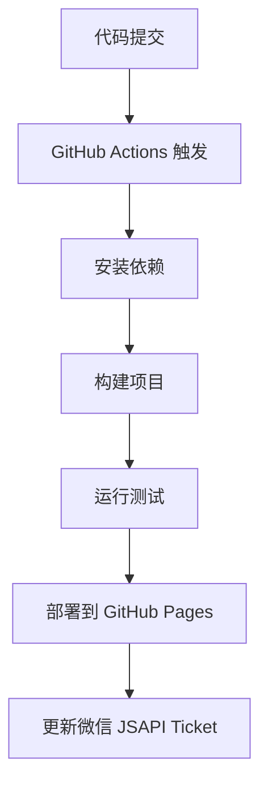

# 🚀 部署指南

详细介绍 RicMoe Docusaurus 主题的部署流程、配置和最佳实践。

## 🎯 部署概览

### 支持的部署平台

- **GitHub Pages** - 免费静态站点托管（推荐）
- **Vercel** - 现代化部署平台
- **Netlify** - JAMstack 部署平台
- **云服务器** - 自建服务器部署

### 部署流程



## 🔧 GitHub Pages 部署

### 1. 基础配置

**配置文件**: `docusaurus.config.ts`

```typescript
const config: Config = {
  title: 'RicMoe',
  tagline: '个人博客和技术分享',
  
  // GitHub Pages 配置
  url: 'https://ricmoe.github.io', // GitHub Pages URL
  baseUrl: '/ricmoe-docusaurus/', // 仓库名称
  
  // GitHub 配置
  organizationName: 'RichardMiku', // GitHub 用户名或组织名
  projectName: 'ricmoe-docusaurus', // 仓库名称
  deploymentBranch: 'gh-pages', // 部署分支
  trailingSlash: false,
  
  // 构建配置
  onBrokenLinks: 'throw',
  onBrokenMarkdownLinks: 'warn',
};
```

### 2. GitHub Actions 自动部署

**文件**: `.github/workflows/deploy.yml`

```yaml
name: Deploy to GitHub Pages

on:
  push:
    branches:
      - main
      - master
  workflow_dispatch:

permissions:
  contents: read
  pages: write
  id-token: write

concurrency:
  group: "pages"
  cancel-in-progress: false

env:
  BUILD_PATH: "."

jobs:
  build:
    name: Build
    runs-on: ubuntu-latest
    steps:
      - name: Checkout
        uses: actions/checkout@v4
        with:
          fetch-depth: 0
      
      - name: Setup Node
        uses: actions/setup-node@v4
        with:
          node-version: "20"
          cache: npm
          cache-dependency-path: ${{ env.BUILD_PATH }}/package-lock.json
      
      - name: Setup Pages
        id: pages
        uses: actions/configure-pages@v4
      
      - name: Install dependencies
        run: npm ci
        working-directory: ${{ env.BUILD_PATH }}
      
      - name: Build with Docusaurus
        run: npm run build
        working-directory: ${{ env.BUILD_PATH }}
      
      - name: Upload artifact
        uses: actions/upload-pages-artifact@v3
        with:
          path: ${{ env.BUILD_PATH }}/build

  deploy:
    environment:
      name: github-pages
      url: ${{ steps.deployment.outputs.page_url }}
    needs: build
    runs-on: ubuntu-latest
    name: Deploy
    steps:
      - name: Deploy to GitHub Pages
        id: deployment
        uses: actions/deploy-pages@v4
```

### 3. 微信 JSAPI Ticket 自动更新

**文件**: `.github/workflows/update-jsapi-ticket.yml`

```yaml
name: Update WeChat JSAPI Ticket

on:
  schedule:
    - cron: '0 */2 * * *'  # 每2小时执行一次
  workflow_dispatch:

jobs:
  update-jsapi-ticket:
    runs-on: ubuntu-latest
    
    steps:
    - name: Checkout code
      uses: actions/checkout@v3
      with:
        token: ${{ secrets.GITHUB_TOKEN }}
    
    - name: Set up Python
      uses: actions/setup-python@v4
      with:
        python-version: '3.9'
    
    - name: Install dependencies
      run: |
        python -m pip install --upgrade pip
        pip install -r requirements.txt
    
    - name: Update JSAPI Ticket
      env:
        WECHAT_APP_ID: ${{ secrets.WECHAT_APP_ID }}
        WECHAT_APP_SECRET: ${{ secrets.WECHAT_APP_SECRET }}
      run: |
        python WeChatAccess.py
    
    - name: Commit and push changes
      run: |
        git config --local user.email "action@github.com"
        git config --local user.name "GitHub Action"
        git add static/js-helper/wx-share.js
        if git diff --staged --quiet; then
          echo "No changes to commit"
        else
          git commit -m "Auto update WeChat JSAPI Ticket"
          git push
        fi
```

### 4. GitHub Pages 设置

1. **仓库设置**:
   - 进入 GitHub 仓库
   - 点击 "Settings" 标签页
   - 在左侧菜单中找到 "Pages"

2. **部署源配置**:
   - Source: GitHub Actions
   - 或选择 Deploy from a branch: `gh-pages`

3. **环境变量配置**:
   - 进入 "Settings" > "Secrets and variables" > "Actions"
   - 添加以下 Secrets:
     - `WECHAT_APP_ID`: 微信公众号 AppID
     - `WECHAT_APP_SECRET`: 微信公众号 AppSecret

## 🌐 Vercel 部署

### 1. 配置文件

**文件**: `vercel.json`

```json
{
  "version": 2,
  "name": "ricmoe-docusaurus",
  "builds": [
    {
      "src": "package.json",
      "use": "@vercel/static-build",
      "config": {
        "distDir": "build"
      }
    }
  ],
  "routes": [
    {
      "src": "/(.*)\\.(js|css|png|jpg|jpeg|gif|svg|ico|woff|woff2|ttf|eot)",
      "headers": {
        "Cache-Control": "public, max-age=31536000, immutable"
      }
    },
    {
      "src": "/(.*)",
      "dest": "/$1.html"
    },
    {
      "handle": "filesystem"
    },
    {
      "src": "/(.*)",
      "dest": "/index.html"
    }
  ],
  "env": {
    "NODE_ENV": "production"
  }
}
```

### 2. 构建脚本配置

**package.json** 添加构建脚本：

```json
{
  "scripts": {
    "build": "docusaurus build",
    "vercel-build": "npm run build"
  }
}
```

### 3. 部署步骤

1. **连接 GitHub**:
   - 登录 [Vercel Dashboard](https://vercel.com/dashboard)
   - 点击 "New Project"
   - 导入 GitHub 仓库

2. **配置环境变量**:
   - 在项目设置中添加环境变量
   - `WECHAT_APP_ID` 和 `WECHAT_APP_SECRET`

3. **自动部署**:
   - 每次推送到主分支自动触发部署
   - 支持预览部署（PR 部署）

## 🔥 Netlify 部署

### 1. 配置文件

**文件**: `netlify.toml`

```toml
[build]
  publish = "build"
  command = "npm run build"

[build.environment]
  NODE_VERSION = "18"
  NPM_VERSION = "9"

[[redirects]]
  from = "/*"
  to = "/index.html"
  status = 200

[[headers]]
  for = "/static/*"
  [headers.values]
    Cache-Control = "public, max-age=31536000, immutable"

[[headers]]
  for = "/*.js"
  [headers.values]
    Cache-Control = "public, max-age=31536000, immutable"

[[headers]]
  for = "/*.css"
  [headers.values]
    Cache-Control = "public, max-age=31536000, immutable"
```

### 2. 部署配置

**文件**: `_redirects` (放在 `static/` 目录下)

```
/*    /index.html   200
```

### 3. 环境变量配置

在 Netlify 控制台中配置：

1. 进入项目设置
2. 点击 "Environment variables"
3. 添加必要的环境变量

## 🖥️ 服务器部署

### 1. Nginx 配置

**文件**: `/etc/nginx/sites-available/ricmoe`

```nginx
server {
    listen 80;
    listen [::]:80;
    server_name your-domain.com www.your-domain.com;

    # 重定向到 HTTPS
    return 301 https://$server_name$request_uri;
}

server {
    listen 443 ssl http2;
    listen [::]:443 ssl http2;
    server_name your-domain.com www.your-domain.com;

    # SSL 证书配置
    ssl_certificate /path/to/cert.pem;
    ssl_certificate_key /path/to/key.pem;

    # 网站根目录
    root /var/www/ricmoe/build;
    index index.html;

    # 静态文件缓存
    location ~* \.(js|css|png|jpg|jpeg|gif|svg|ico|woff|woff2|ttf|eot)$ {
        expires 1y;
        add_header Cache-Control "public, immutable";
        access_log off;
    }

    # SPA 路由处理
    location / {
        try_files $uri $uri/ /index.html;
    }

    # 安全头部
    add_header X-Frame-Options "SAMEORIGIN" always;
    add_header X-Content-Type-Options "nosniff" always;
    add_header X-XSS-Protection "1; mode=block" always;
    add_header Referrer-Policy "strict-origin-when-cross-origin" always;
    add_header Content-Security-Policy "default-src 'self'; script-src 'self' 'unsafe-inline' res.wx.qq.com; style-src 'self' 'unsafe-inline'; img-src 'self' data: https:; font-src 'self';" always;

    # Gzip 压缩
    gzip on;
    gzip_vary on;
    gzip_min_length 1024;
    gzip_proxied expired no-cache no-store private auth;
    gzip_types
        text/plain
        text/css
        text/xml
        text/javascript
        application/javascript
        application/xml+rss
        application/json;
}
```

### 2. 部署脚本

**文件**: `deploy.sh`

```bash
#!/bin/bash

# 配置变量
REPO_URL="https://github.com/RichardMiku/ricmoe-docusaurus.git"
DEPLOY_PATH="/var/www/ricmoe"
BACKUP_PATH="/var/backups/ricmoe"
LOG_FILE="/var/log/ricmoe-deploy.log"

# 日志函数
log() {
    echo "[$(date '+%Y-%m-%d %H:%M:%S')] $1" | tee -a $LOG_FILE
}

# 错误处理
set -e
trap 'log "部署失败，正在回滚..."; rollback' ERR

# 备份当前版本
backup() {
    if [ -d "$DEPLOY_PATH" ]; then
        log "备份当前版本..."
        sudo cp -r $DEPLOY_PATH $BACKUP_PATH/$(date +%Y%m%d_%H%M%S)
        
        # 保留最近5个备份
        sudo find $BACKUP_PATH -maxdepth 1 -type d -name "20*" | sort -r | tail -n +6 | xargs -r sudo rm -rf
    fi
}

# 回滚函数
rollback() {
    local latest_backup=$(sudo find $BACKUP_PATH -maxdepth 1 -type d -name "20*" | sort -r | head -1)
    if [ -n "$latest_backup" ]; then
        log "回滚到上一个版本: $latest_backup"
        sudo rm -rf $DEPLOY_PATH
        sudo cp -r $latest_backup $DEPLOY_PATH
        sudo systemctl reload nginx
    fi
}

# 主部署流程
main() {
    log "开始部署..."
    
    # 备份
    backup
    
    # 创建临时目录
    TEMP_DIR=$(mktemp -d)
    cd $TEMP_DIR
    
    # 克隆代码
    log "克隆代码库..."
    git clone $REPO_URL .
    
    # 安装依赖
    log "安装依赖..."
    npm ci
    
    # 构建项目
    log "构建项目..."
    npm run build
    
    # 部署到目标目录
    log "部署文件..."
    sudo rm -rf $DEPLOY_PATH
    sudo mkdir -p $DEPLOY_PATH
    sudo cp -r build/* $DEPLOY_PATH/
    
    # 设置权限
    sudo chown -R www-data:www-data $DEPLOY_PATH
    sudo chmod -R 755 $DEPLOY_PATH
    
    # 重新加载 Nginx
    log "重新加载 Nginx..."
    sudo nginx -t && sudo systemctl reload nginx
    
    # 清理临时文件
    rm -rf $TEMP_DIR
    
    log "部署完成！"
}

# 执行部署
main "$@"
```

### 3. 自动更新脚本

**文件**: `auto-update.sh`

```bash
#!/bin/bash

# 配置
SCRIPT_DIR="/opt/ricmoe-deploy"
PYTHON_SCRIPT="$SCRIPT_DIR/WeChatAccess.py"
JS_FILE="/var/www/ricmoe/static/js-helper/wx-share.js"

# 更新微信 JSAPI Ticket
update_jsapi_ticket() {
    cd $SCRIPT_DIR
    
    # 执行 Python 脚本
    python3 $PYTHON_SCRIPT
    
    # 复制更新后的文件
    if [ -f "static/js-helper/wx-share.js" ]; then
        cp "static/js-helper/wx-share.js" $JS_FILE
        echo "JSAPI Ticket 更新完成"
    fi
}

# 设置 cron 任务
# 0 */2 * * * /opt/scripts/auto-update.sh
update_jsapi_ticket
```

## 📊 监控和日志

### 1. 部署监控

**健康检查脚本**: `health-check.sh`

```bash
#!/bin/bash

SITE_URL="https://your-domain.com"
EXPECTED_TITLE="RicMoe"
LOG_FILE="/var/log/site-health.log"

# 检查网站是否可访问
check_site() {
    local response=$(curl -s -o /dev/null -w "%{http_code}" $SITE_URL)
    
    if [ "$response" = "200" ]; then
        echo "[$(date)] ✅ Site is accessible (HTTP $response)" >> $LOG_FILE
        
        # 检查页面内容
        local title=$(curl -s $SITE_URL | grep -o "<title>[^<]*" | sed 's/<title>//')
        if [[ "$title" == *"$EXPECTED_TITLE"* ]]; then
            echo "[$(date)] ✅ Site content is correct" >> $LOG_FILE
        else
            echo "[$(date)] ❌ Site content may be corrupted" >> $LOG_FILE
            send_alert "Site content check failed"
        fi
    else
        echo "[$(date)] ❌ Site is not accessible (HTTP $response)" >> $LOG_FILE
        send_alert "Site is down - HTTP $response"
    fi
}

# 发送告警
send_alert() {
    local message="$1"
    # 这里可以集成邮件、钉钉、微信等告警方式
    echo "ALERT: $message" >> $LOG_FILE
}

# 执行检查
check_site
```

### 2. 性能监控

**性能监控脚本**: `performance-monitor.sh`

```bash
#!/bin/bash

SITE_URL="https://your-domain.com"
LOG_FILE="/var/log/site-performance.log"

# 性能检查
check_performance() {
    local start_time=$(date +%s%3N)
    local response=$(curl -s -o /dev/null -w "%{time_total},%{time_namelookup},%{time_connect},%{time_starttransfer}" $SITE_URL)
    local end_time=$(date +%s%3N)
    
    IFS=',' read -r total_time dns_time connect_time first_byte_time <<< "$response"
    
    echo "[$(date)] Performance: Total=${total_time}s, DNS=${dns_time}s, Connect=${connect_time}s, TTFB=${first_byte_time}s" >> $LOG_FILE
    
    # 如果总时间超过5秒，发送告警
    if (( $(echo "$total_time > 5.0" | bc -l) )); then
        echo "[$(date)] WARNING: Slow response time: ${total_time}s" >> $LOG_FILE
    fi
}

check_performance
```

## 🔒 安全配置

### 1. HTTPS 配置

使用 Let's Encrypt 免费 SSL 证书：

```bash
# 安装 Certbot
sudo apt update
sudo apt install certbot python3-certbot-nginx

# 获取 SSL 证书
sudo certbot --nginx -d your-domain.com -d www.your-domain.com

# 自动续期
sudo crontab -e
# 添加以下行：
# 0 12 * * * /usr/bin/certbot renew --quiet
```

### 2. 防火墙配置

```bash
# 配置 UFW 防火墙
sudo ufw default deny incoming
sudo ufw default allow outgoing
sudo ufw allow ssh
sudo ufw allow 'Nginx Full'
sudo ufw enable

# 查看状态
sudo ufw status
```

### 3. 安全头部

在 Nginx 配置中添加安全头部：

```nginx
# 安全头部配置
add_header Strict-Transport-Security "max-age=31536000; includeSubDomains" always;
add_header X-Frame-Options "SAMEORIGIN" always;
add_header X-Content-Type-Options "nosniff" always;
add_header X-XSS-Protection "1; mode=block" always;
add_header Referrer-Policy "strict-origin-when-cross-origin" always;
add_header Permissions-Policy "geolocation=(), microphone=(), camera=()" always;
```

## 🔧 故障排除

### 1. 常见问题

**构建失败**:
```bash
# 清除缓存
npm run clear
rm -rf node_modules package-lock.json
npm install
npm run build
```

**部署失败**:
```bash
# 检查 GitHub Actions 日志
# 验证环境变量配置
# 确认分支保护规则
```

**微信分享失败**:
```bash
# 检查 JSAPI Ticket 是否有效
# 验证域名白名单配置
# 查看浏览器控制台错误
```

### 2. 调试工具

```bash
# 本地预览构建结果
npm run build
npm run serve

# 检查链接
npm run build
npx broken-link-checker http://localhost:3000

# 性能分析
npm run build
npx lighthouse http://localhost:3000 --view
```

## 📋 部署检查清单

### 部署前检查

- [ ] 代码已提交到正确分支
- [ ] 环境变量已正确配置
- [ ] 域名 DNS 已正确配置
- [ ] SSL 证书已申请并配置
- [ ] 微信公众号域名白名单已添加

### 部署后检查

- [ ] 网站可正常访问
- [ ] 所有页面路由正常
- [ ] 图片和静态资源加载正常
- [ ] 微信分享功能正常
- [ ] 搜索功能正常
- [ ] 移动端显示正常
- [ ] 性能指标符合预期

### 监控设置

- [ ] 健康检查脚本已设置
- [ ] 性能监控已配置
- [ ] 告警通知已设置
- [ ] 日志轮转已配置
- [ ] 备份策略已实施

## 🔗 相关文档

- [🏗️ 项目架构详解](./architecture)
- [📦 构建配置详解](./build-config)
- [📱 微信集成文档](../wechat)

---

*部署遇到问题？查看对应平台的官方文档或提出 Issue！*
