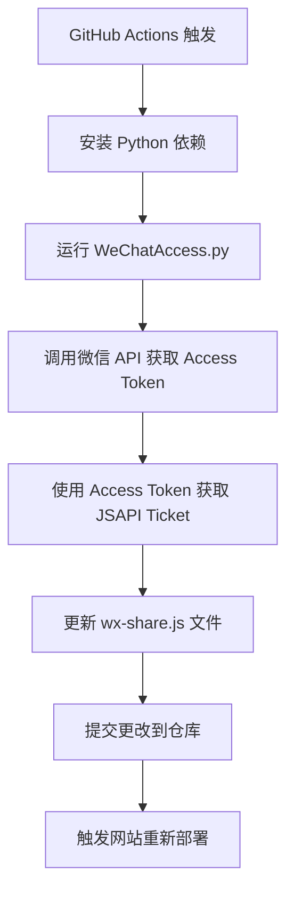

# 微信 JSAPI Ticket 自动更新

实现微信分享功能所需的 JSAPI Ticket 自动化管理系统。

## 🎯 功能说明

本项目包含一个自动化脚本，用于定期更新微信分享功能所需的 JSAPI Ticket，确保微信分享功能持续可用。

## 📁 相关文件

- `WeChatAccess.py` - 主要脚本，用于获取微信 JSAPI Ticket 并更新 `wx-share.js` 文件
- `.github/workflows/update-jsapi-ticket.yml` - GitHub Action 工作流，每 2 小时自动执行一次
- `requirements.txt` - Python 依赖包列表
- `static/js-helper/wx-share.js` - 微信分享 JS 文件（会被自动更新）

## ⚙️ 配置步骤

### 第一步：设置 GitHub Secrets

在 GitHub 仓库的 **Settings > Secrets and variables > Actions** 中添加以下 secrets:

| Secret 名称 | 说明 | 获取方式 |
|-------------|------|----------|
| `WECHAT_APP_ID` | 微信公众号/小程序的 AppID | 微信公众平台 > 基本配置 |
| `WECHAT_APP_SECRET` | 微信公众号/小程序的 AppSecret | 微信公众平台 > 基本配置 |

### 第二步：微信公众平台配置

1. **登录微信公众平台**
   - 访问：https://mp.weixin.qq.com/
   - 使用管理员微信扫码登录

2. **获取 AppID 和 AppSecret**
   ```
   左侧菜单 > 基本配置 > 公众号开发信息
   - AppID: 复制并保存
   - AppSecret: 生成并保存（注意保密）
   ```

3. **配置 JS 安全域名**
   ```
   左侧菜单 > 公众号设置 > 功能设置 > JS接口安全域名
   添加你的网站域名，如：ricmoe.com
   ```

### 第三步：验证配置

配置完成后，GitHub Actions 会自动运行。你可以在 **Actions** 标签页查看运行状态。

## 🔄 工作流程

### 自动更新流程



### 更新频率

- **自动更新**: 每 2 小时执行一次
- **手动触发**: 可在 Actions 页面手动运行
- **Ticket 有效期**: 7200 秒（2 小时）

## 🐍 Python 脚本详解

### WeChatAccess.py 核心功能

```python
import requests
import json
import os
from datetime import datetime

class WeChatAPI:
    def __init__(self, app_id, app_secret):
        self.app_id = app_id
        self.app_secret = app_secret
        self.access_token = None
        self.jsapi_ticket = None
    
    def get_access_token(self):
        """获取微信 Access Token"""
        url = f"https://api.weixin.qq.com/cgi-bin/token"
        params = {
            'grant_type': 'client_credential',
            'appid': self.app_id,
            'secret': self.app_secret
        }
        
        response = requests.get(url, params=params)
        data = response.json()
        
        if 'access_token' in data:
            self.access_token = data['access_token']
            return True
        else:
            print(f"获取 Access Token 失败: {data}")
            return False
    
    def get_jsapi_ticket(self):
        """获取 JSAPI Ticket"""
        if not self.access_token:
            return False
        
        url = f"https://api.weixin.qq.com/cgi-bin/ticket/getticket"
        params = {
            'access_token': self.access_token,
            'type': 'jsapi'
        }
        
        response = requests.get(url, params=params)
        data = response.json()
        
        if data.get('errcode') == 0:
            self.jsapi_ticket = data['ticket']
            return True
        else:
            print(f"获取 JSAPI Ticket 失败: {data}")
            return False
    
    def update_js_file(self):
        """更新 wx-share.js 文件"""
        js_content = f"""
// 微信分享配置 - 自动生成于 {datetime.now().strftime('%Y-%m-%d %H:%M:%S')}
const WECHAT_CONFIG = {{
    appId: '{self.app_id}',
    jsApiTicket: '{self.jsapi_ticket}',
    timestamp: {int(datetime.now().timestamp())},
    nonceStr: '{self.generate_nonce_str()}'
}};

// 微信分享初始化
function initWeChatShare() {{
    // 微信分享配置逻辑
    console.log('微信分享配置已加载');
}}

// 生成随机字符串
function generateNonceStr() {{
    return Math.random().toString(36).substr(2, 15);
}}

// 导出配置
if (typeof module !== 'undefined' && module.exports) {{
    module.exports = WECHAT_CONFIG;
}}
"""
        
        with open('static/js-helper/wx-share.js', 'w', encoding='utf-8') as f:
            f.write(js_content)
        
        print("wx-share.js 文件已更新")
```

## 📋 GitHub Actions 配置

### .github/workflows/update-jsapi-ticket.yml

```yaml
name: Update WeChat JSAPI Ticket

on:
  schedule:
    # 每2小时执行一次
    - cron: '0 */2 * * *'
  workflow_dispatch: # 允许手动触发

jobs:
  update-ticket:
    runs-on: ubuntu-latest
    
    steps:
    - name: Checkout repository
      uses: actions/checkout@v3
      
    - name: Set up Python
      uses: actions/setup-python@v4
      with:
        python-version: '3.9'
        
    - name: Install dependencies
      run: |
        python -m pip install --upgrade pip
        pip install -r requirements.txt
        
    - name: Update JSAPI Ticket
      env:
        WECHAT_APP_ID: ${{ secrets.WECHAT_APP_ID }}
        WECHAT_APP_SECRET: ${{ secrets.WECHAT_APP_SECRET }}
      run: |
        python WeChatAccess.py
        
    - name: Commit and push changes
      run: |
        git config --local user.email "action@github.com"
        git config --local user.name "GitHub Action"
        git add static/js-helper/wx-share.js
        if git diff --staged --quiet; then
          echo "No changes to commit"
        else
          git commit -m "🔄 自动更新微信 JSAPI Ticket $(date +'%Y-%m-%d %H:%M:%S')"
          git push
        fi
```

## 🔧 故障排除

### 常见问题

#### 1. Access Token 获取失败
**错误信息**: `"errcode": 40013, "errmsg": "invalid appid"`

**解决方案**:
- 检查 `WECHAT_APP_ID` 是否正确
- 确认是否为有效的微信公众号 AppID
- 检查 GitHub Secrets 配置

#### 2. JSAPI Ticket 获取失败
**错误信息**: `"errcode": 40001, "errmsg": "invalid credential"`

**解决方案**:
- 检查 `WECHAT_APP_SECRET` 是否正确
- 确认 AppSecret 是否已过期
- 重新生成 AppSecret

#### 3. 域名安全性错误
**错误信息**: 分享功能在网页中不工作

**解决方案**:
- 在微信公众平台配置 JS 安全域名
- 确保域名与实际访问域名一致
- 不需要包含 `http://` 或 `https://`

### 调试方法

#### 1. 查看 Actions 日志
```bash
# 在 GitHub Actions 页面查看详细日志
# 检查每个步骤的执行结果
```

#### 2. 本地测试
```python
# 在本地运行脚本进行测试
export WECHAT_APP_ID="your_app_id"
export WECHAT_APP_SECRET="your_app_secret"
python WeChatAccess.py
```

#### 3. 验证 Ticket 有效性
```javascript
// 在浏览器控制台检查
console.log(WECHAT_CONFIG);
// 检查 jsApiTicket 是否存在且不为空
```

## 📈 监控和维护

### 监控指标

1. **自动更新成功率**: GitHub Actions 运行成功次数
2. **Ticket 有效性**: 微信分享功能是否正常工作
3. **错误日志**: 失败时的错误信息记录

### 维护建议

1. **定期检查**: 每月检查一次 Actions 运行状态
2. **备份配置**: 保存 AppID 和 AppSecret 的备份
3. **更新依赖**: 定期更新 Python 依赖包
4. **测试功能**: 定期测试微信分享功能是否正常

## 🔐 安全注意事项

1. **Secrets 保护**: 
   - 不要在代码中硬编码 AppID 和 AppSecret
   - 使用 GitHub Secrets 存储敏感信息
   - 定期轮换 AppSecret

2. **权限控制**:
   - 仅授权必要的人员访问 GitHub Secrets
   - 使用最小权限原则

3. **监控异常**:
   - 关注异常的 API 调用
   - 监控 Access Token 使用情况

---

**下一步**: 查看 [微信分享配置](./share-config) 了解如何在页面中使用微信分享功能。
